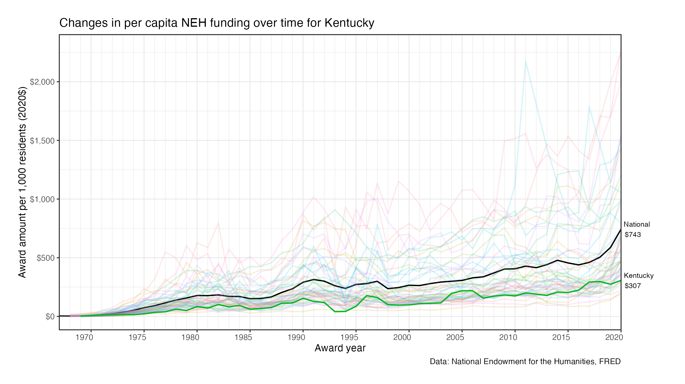

---
---

# State by state differences in per capita NEH funding, 1967 - 2020

## Differences across the states

## Links to all state figures

Figures for the changes in per capita NEH spending by state over time for states
are linked below.

| State                             | State                              |
|:----------------------------------|:-----------------------------------|
| [Alabama](./figures/AL.png)       | [Montana](./figures/MT.png)        |
| [Alaska](./figures/AK.png)        | [Nebraska](./figures/NE.png)       |
| [Arizona](./figures/AZ.png)       | [Nevada](./figures/NV.png)         |
| [Arkansas](./figures/AR.png)      | [New Hampshire](./figures/NH.png)  |
| [California](./figures/CA.png)    | [New Jersey](./figures/NJ.png)     |
| [Colorado](./figures/CO.png)      | [New Mexico](./figures/NM.png)     |
| [Connecticut](./figures/CT.png)   | [New York](./figures/NY.png)       |
| [Delaware](./figures/DE.png)      | [North Carolina](./figures/NC.png) |
| [Florida](./figures/FL.png)       | [North Dakota](./figures/ND.png)   |
| [Georgia](./figures/GA.png)       | [Ohio](./figures/OH.png)           |
| [Hawaii](./figures/HI.png)        | [Oklahoma](./figures/OK.png)       |
| [Idaho](./figures/ID.png)         | [Oregon](./figures/OR.png)         |
| [Illinois](./figures/IL.png)      | [Pennsylvania](./figures/PA.png)   |
| [Indiana](./figures/IN.png)       | [Rhode Island](./figures/RI.png)   |
| [Iowa](./figures/IA.png)          | [South Carolina](./figures/SC.png) |
| [Kansas](./figures/KS.png)        | [South Dakota](./figures/SD.png)   |
| [Kentucky](./figures/KY.png)      | [Tennessee](./figures/TN.png)      |
| [Louisiana](./figures/LA.png)     | [Texas](./figures/TX.png)          |
| [Maine](./figures/ME.png)         | [Utah](./figures/UT.png)           |
| [Maryland](./figures/MD.png)      | [Vermont](./figures/VT.png)        |
| [Massachusetts](./figures/MA.png) | [Virginia](./figures/VA.png)       |
| [Michigan](./figures/MI.png)      | [Washington](./figures/WA.png)     |
| [Minnesota](./figures/MN.png)     | [West Virginia](./figures/WV.png)  |
| [Mississippi](./figures/MS.png)   | [Wisconsin](./figures/WI.png)      |
| [Missouri](./figures/MO.png)      | [Wyoming](./figures/WY.png)        |

