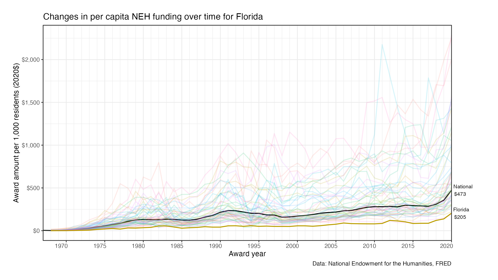

---
---

# State by state differences in per capita NEH funding, 1967 - 2020

Established in the 1960s in the midst of the space race, the National Endowment
for the Humanities has grown from an initial endowment of [$20
million](https://www.neh.gov/about/history) to awarding nearly [$200 million in
FY2020](https://www.neh.gov/sites/default/files/inline-files/NEH%202020%20Annual%20Report.pdf).
Among domestically awarded grants, this represents $473 spent per 1,000 persons
in the United States in 2020.

Of interest is how these funds have been awarded across the country. Despite its
federal origins and purview, it is worth examining the how the distribution of
dollars may differ across the states.

## Differences across the states

## Links to all state figures

Figures for the changes in per capita NEH spending by state over time for states
are linked below.

| State                             | State                              |
|:----------------------------------|:-----------------------------------|
| [Alabama](./figures/AL.png)       | [Montana](./figures/MT.png)        |
| [Alaska](./figures/AK.png)        | [Nebraska](./figures/NE.png)       |
| [Arizona](./figures/AZ.png)       | [Nevada](./figures/NV.png)         |
| [Arkansas](./figures/AR.png)      | [New Hampshire](./figures/NH.png)  |
| [California](./figures/CA.png)    | [New Jersey](./figures/NJ.png)     |
| [Colorado](./figures/CO.png)      | [New Mexico](./figures/NM.png)     |
| [Connecticut](./figures/CT.png)   | [New York](./figures/NY.png)       |
| [Delaware](./figures/DE.png)      | [North Carolina](./figures/NC.png) |
| [Florida](./figures/FL.png)       | [North Dakota](./figures/ND.png)   |
| [Georgia](./figures/GA.png)       | [Ohio](./figures/OH.png)           |
| [Hawaii](./figures/HI.png)        | [Oklahoma](./figures/OK.png)       |
| [Idaho](./figures/ID.png)         | [Oregon](./figures/OR.png)         |
| [Illinois](./figures/IL.png)      | [Pennsylvania](./figures/PA.png)   |
| [Indiana](./figures/IN.png)       | [Rhode Island](./figures/RI.png)   |
| [Iowa](./figures/IA.png)          | [South Carolina](./figures/SC.png) |
| [Kansas](./figures/KS.png)        | [South Dakota](./figures/SD.png)   |
| [Kentucky](./figures/KY.png)      | [Tennessee](./figures/TN.png)      |
| [Louisiana](./figures/LA.png)     | [Texas](./figures/TX.png)          |
| [Maine](./figures/ME.png)         | [Utah](./figures/UT.png)           |
| [Maryland](./figures/MD.png)      | [Vermont](./figures/VT.png)        |
| [Massachusetts](./figures/MA.png) | [Virginia](./figures/VA.png)       |
| [Michigan](./figures/MI.png)      | [Washington](./figures/WA.png)     |
| [Minnesota](./figures/MN.png)     | [West Virginia](./figures/WV.png)  |
| [Mississippi](./figures/MS.png)   | [Wisconsin](./figures/WI.png)      |
| [Missouri](./figures/MO.png)      | [Wyoming](./figures/WY.png)        |

