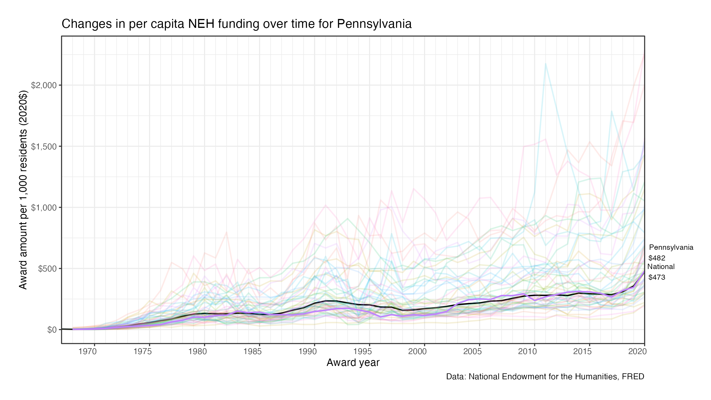

---
---

# State by state differences in per capita NEH funding, 1967 - 2020

Established in the 1960s in the midst of the space race, the National Endowment
for the Humanities has grown from an initial endowment of [\$20
million](https://www.neh.gov/about/history) to awarding nearly [\$200 million in
FY2020](https://www.neh.gov/sites/default/files/inline-files/NEH%202020%20Annual%20Report.pdf).
Among domestically awarded grants, this represents $473 spent per 1,000 persons
in the United States in 2020.

Of interest is how these funds have been awarded across the country. Despite its
federal origins and purview, it is worth examining how the distribution of
dollars may differ across the states. Below are three examples of differences in
funding experienced across the states.

## Differences across the states

Residents of Pennsylvania are respresentative of NEH awards in that their
funding levels have generally tracked the national trend line over time. In the
fiscal year 2020, approximately \$482 were spent for every 1,000 residents of
Pennsylvania. Residents of Iowa (\$535), Indiana (\$477), Minnesota (\$473),
Oregon (\$415), and South Carolina (\$397) have similarly seen per capita award
amounts that have tracked national trends.

In comparison, residents of Massachusetts have consistently received large per
capita NEH award amounts. Ending in 2020, Massachusetts residents received
\$1,209 per 1,000 persons, their highest ever. Massachusetts was awarded over
\$900 (inflation adjusted to 2020 dollars) per 1,000 residents in five other
years (1993, 2011, 2013, 2015, and 2019). A few other states, such as Alaska,
Montana, and North Dakota have also consistently received high per capita
funding over time. However, the sparse populations of these states mean that
even comparatively smaller award amounts will be realized as higher per capita
values.

On the other side, the state of Florida has consistently had a low per capita
award rate. In 2020, Floridians received the most they ever have, \$205 per 1000
residents, which only slightly higher than Texas's \$193, the lowest in the
nation. In no year since the start of the NEH have Florida residents received at
or above the national average. Adjusting for inflation, Florida residents at
their highest per capita funding received more than Massachusetts residents only
in the latter's eight lowest funded years, 1968-1975.

## Links to all state figures

Figures for the changes in per capita NEH spending by state over time for states
are linked below.

<!-- 
 -->
          
| State                             | State                              |
|:----------------------------------|:-----------------------------------|
| [Alabama](./figures/AL.png)       | [Montana](./figures/MT.png)        |
| [Alaska](./figures/AK.png)        | [Nebraska](./figures/NE.png)       |
| [Arizona](./figures/AZ.png)       | [Nevada](./figures/NV.png)         |
| [Arkansas](./figures/AR.png)      | [New Hampshire](./figures/NH.png)  |
| [California](./figures/CA.png)    | [New Jersey](./figures/NJ.png)     |
| [Colorado](./figures/CO.png)      | [New Mexico](./figures/NM.png)     |
| [Connecticut](./figures/CT.png)   | [New York](./figures/NY.png)       |
| [Delaware](./figures/DE.png)      | [North Carolina](./figures/NC.png) |
| [Florida](./figures/FL.png)       | [North Dakota](./figures/ND.png)   |
| [Georgia](./figures/GA.png)       | [Ohio](./figures/OH.png)           |
| [Hawaii](./figures/HI.png)        | [Oklahoma](./figures/OK.png)       |
| [Idaho](./figures/ID.png)         | [Oregon](./figures/OR.png)         |
| [Illinois](./figures/IL.png)      | [Pennsylvania](./figures/PA.png)   |
| [Indiana](./figures/IN.png)       | [Rhode Island](./figures/RI.png)   |
| [Iowa](./figures/IA.png)          | [South Carolina](./figures/SC.png) |
| [Kansas](./figures/KS.png)        | [South Dakota](./figures/SD.png)   |
| [Kentucky](./figures/KY.png)      | [Tennessee](./figures/TN.png)      |
| [Louisiana](./figures/LA.png)     | [Texas](./figures/TX.png)          |
| [Maine](./figures/ME.png)         | [Utah](./figures/UT.png)           |
| [Maryland](./figures/MD.png)      | [Vermont](./figures/VT.png)        |
| [Massachusetts](./figures/MA.png) | [Virginia](./figures/VA.png)       |
| [Michigan](./figures/MI.png)      | [Washington](./figures/WA.png)     |
| [Minnesota](./figures/MN.png)     | [West Virginia](./figures/WV.png)  |
| [Mississippi](./figures/MS.png)   | [Wisconsin](./figures/WI.png)      |
| [Missouri](./figures/MO.png)      | [Wyoming](./figures/WY.png)        |

<!-- 
 -->

## Technical details

Primary data for these analyses come from the [National Endowment for the
Humanities](https://catalog.data.gov/organization/neh-gov). Inflation
adjustments and interstitial state-level population estimates come from the
[Federal Reserve Economic Data (FRED)](https://fred.stlouisfed.org) database.
Dollar amounts for all figures have been inflation adjusted to real 2020
dollars. To smooth out differences in award years, 3-year rolling averages were
computed and used. All analyses were completed using the [R programming language](https://cran.r-project.org). Replication files can be found on [GitHub](https://github.com/btskinner/neh).
